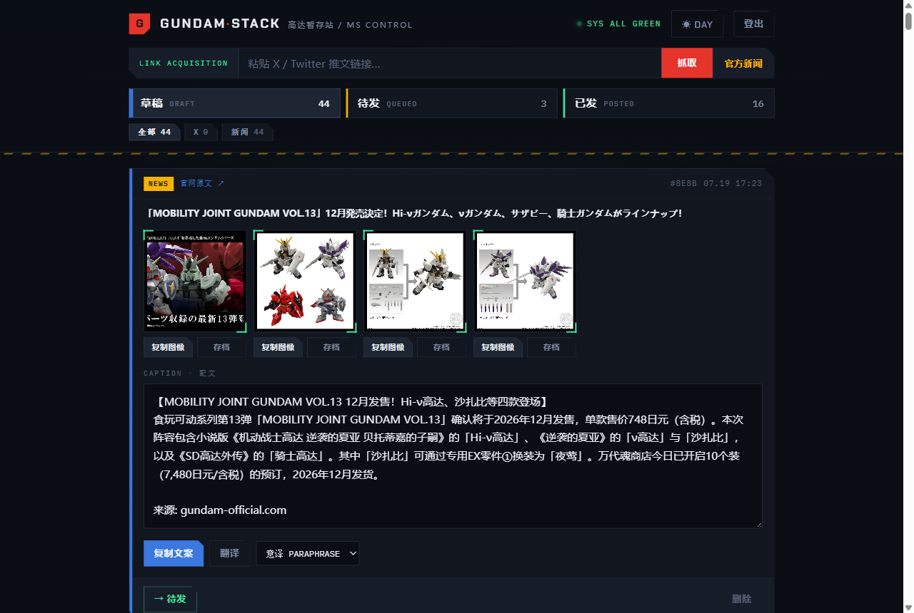

# gundam-stack

个人用的高达微博搬运暂存站。白天刷到的 X 高达图先攒进来,配好文案,点一下或定个时间,家里的小主机自动发到微博。官网新闻也会自动抓进来,AI 写好中文快讯当草稿。

线上跑在 Cloudflare 免费额度里,发布靠一台常开的 N150 小主机。



```
浏览器 ── Cloudflare Worker (Hono + D1 + R2)
              │  ↑ 60s 轮询定时任务 / kick 即时触发
              ▼
        cloudflared 隧道
              ▼
        家里 N150 (publisher.js) ── opencli ── 已登录微博的 Chrome
```

## 功能

- 贴 X 链接抓原图原文,DeepSeek 翻译,`原文 + X: @作者` 格式配文
- 抓 gundam-official.com 新闻(解析 Next.js RSC 数据,不开浏览器),AI 生成微博风快讯,删过的新闻不会重复拉
- 发布 / 定时发布:时间存 D1,家里机器每分钟来取,关掉浏览器照发
- 发没发成,以微博时间线为准(opencli 自己的成功检测不可靠),不会误标、不会重复发
- 草稿按来源筛选(X / 新闻),新闻草稿一键清空

## 目录

| 路径 | 内容 |
|---|---|
| `src/` | Worker:路由、抓取、翻译、新闻解析 |
| `public/` | 纯静态前端,无构建 |
| `publisher/` | 跑在家里机器上的发布服务 + opencli 补丁 |
| `schema.sql` | D1 表结构 |

## 部署

Worker 侧:

```bash
npm install
npx wrangler d1 create gundam-stack        # database_id 填进 wrangler.toml
npx wrangler r2 bucket create gundam-stack-images
npx wrangler d1 execute gundam-stack --remote --file=./schema.sql
npx wrangler secret put APP_PASSWORD
npx wrangler secret put DEEPSEEK_API_KEY
npx wrangler secret put PUB_TOKEN          # 与发布机 config.json 同值
npm run deploy
```

发布机侧(Windows,需要 Node 22+、Chrome 登录微博、[opencli](https://github.com/jackwener/opencli) + Browser Bridge 扩展):

1. 把 `publisher/` 拷过去,`config.json.example` 抄成 `config.json` 填好
2. `node publisher.js` 跑通后注册成开机服务(WinSW / 计划任务均可),Chrome 也要开机自启
3. cloudflared 隧道把服务暴露给 Worker(`PUB_URL`)

`publisher.js` 启动时会自动给 opencli 打补丁(`patch-opencli.js`):修掉带图发布时文案写错编辑器的 bug。opencli 升级后重启服务即可重打。

## 本地开发

```bash
cp .dev.vars.example .dev.vars
npm run db:local
npm run dev
```
